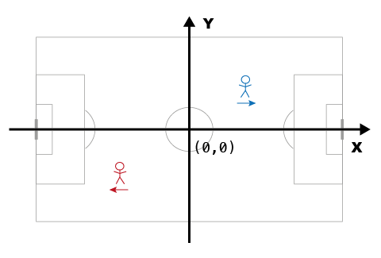
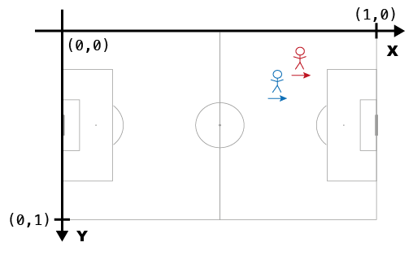

# Coordinates

There are notable differences in how various data providers manage the spatial aspect of the data. They all rely on Cartesian coordinate systems to indicate locations on the pitch. However, the specific coordinate systems employed by providers are not uniform. They differ in the location of the origin, the orientation of the axes, and the scaling of the axes. In this section, we will first examine a few common spatial reference systems before introducing kloppy's approach for handling spatial data.

## Common Spatial Reference Systems
The most straightforward way to fixate position data in a Cartesian coordinate system is to center the playing field at the coordinate system's origin. This way, the center mark of the pitch is at the coordinate (0,0). It looks something like this:



In this coordinate system, interpreting a player's position is intuitive. For example, if a player's coordinates at some point are (22, 14) you know that they are located 22 units right and 14 units above the center of the pitch. However, knowing the unit of measurement (meters, centimeters, or yards) is essential to be able to interpret these coordinates, as different providers may use different units.

Another common approach is to align the origin with the top-left or bottom-left corner of the pitch. This ensures all coordinates are positive, unless the player moves outside the pitch boundaries. Here’s an example:


This highlights a second important aspect: pitch dimensions. The coordinate system itself does not specify whether a player is in or out of bounds. To clarify, imagine a player is standing at (120,0). Unless you know the actual length of the pitch (i.e., the max value along the x-dimension),[^1] you can’t tell if the player is inside or outside the pitch.

Things become more complex when analyzing data across matches played on pitches of varying dimensions. For instance, if you wish to analyze actions within predefined zones, those zones must be adjusted for each pitch format. To address this issue, many providers, particularly those offering event data, opt to standardize pitch dimensions.

In standardized systems, all pitch data is projected onto a field of fixed dimensions. For example, kloppy's default pitch is represented as 1 unit long by 1 unit wide. No unit of measurement really applies here, but one can interpret the values as percentages.


Standardized pitch dimensions are convenient when comparing data across matches. It is problematic though if you want to compute anything that involves distances. All metric information gets distorted during standardization, and all related calculations require a mapping back to actual pitch sizes to be correct.

Another aspect of standardization involves aligning playing directions. To simplify data visualization and analysis, some providers standardize the playing direction so that all attacking ctions occur in the same direction (e.g., left-to-right). Consider plotting all shots taken by a player in a season. If the data is standardized to always represent attacks in one direction, visualizations become much easier to interpret.




## Creating a Coordinate System

These examples include the most common approaches to encode locations in soccer match data. All have pro's and con's. Therefore, kloppy supports all of them and makes transformations between these systems straightforward.

You can define your own coordinate system by extending the [`CoordinateSystem`][kloppy.domain.CoordinateSystem] base class.

```Python
@dataclass
class MyCoordinateSystem(CoordinateSystem):
    @property
    def origin(self) -> Origin:
        return Origin.TOP_LEFT

    @property
    def vertical_orientation(self) -> VerticalOrientation:
        return VerticalOrientation.TOP_TO_BOTTOM

    @property
    def pitch_dimensions(self) -> PitchDimensions:
        return NormalizedPitchDimensions(
            x_dim=Dimension(0, 1),
            y_dim=Dimension(0, 1),
            pitch_length=105,
            pitch_width=68,
            standardized=True,
        )
```


A coordinate system is fully defined by three components: an origin, a direction of the y-axis, and the pitch dimensions. Each of these are represented with a dedicated core object.

### Origin

### VerticalOrientation

### PitchDimensions

A [`PitchDimensions`][kloppy.domain.PitchDimensions] entity fully describes the dimensions and markings of a pitch. This is how you create a 105-by-68 meter pitch with the standard dimensions in according to the IFAB regulations:

```Python
from kloppy.domain import PitchDimensions, Dimension, Unit

pitch_dimensions = PitchDimensions(
    # pitch boundaries
    x_dim=Dimension(min=0, max=105),
    y_dim=Dimension(min=0, max=68),
    unit=Unit.METERS,
    # standardized or real dimensions
    standardized=False,
    # pitch markings
    goal_width=7.32,
    goal_height=2.44,
    six_yard_width=18.32,
    six_yard_length=5.5,
    penalty_area_width=40.32,
    penalty_area_length=16.5,
    circle_radius=9.15,
    corner_radius=1,
    penalty_spot_distance=11,
    penalty_arc_radius=9.15,
)
```

First, the `x_dim` and `y_dim` attributes specify the minimum and maximum value of coordinates inside the pitch boundaries along both axes. In case of `standardized` pitch dimensions, these are not necessarily related to the actual pitch length and width. 

Notice that you don’t technically need the actual pitch length and widths to process the data, they are purely optional. In case of the first pitch, they are easily derived from the x- and ylim properties. But not in the case of the Opta pitch.
To get non-distored calculations, the `length` and `width` of the pitch need to be specified.


Furthermore, `unit` refers to the unit of measurement. Possible values are `"METERS"`, `"CENTIMETERS"`, `"YARDS"`, `"FEET"` or `"NORMED"`. The latter is a special value to indicate that no real unit applies to be used with standardized pitch dimensions such as [0,1] or [0,100].

Most of the attributes are related to the pitch markings. These are independent of the actual size of the pitch.

For convenience we’ve included major data provider pitches

- IFAB regulations: MetricPitchDimensions vs ImperialPitchDimensions
- Provider-specific standardized pitch dimensions: Opta, Wyscout, StatsBomb

## Specifying the Attacking Direction

An [`Orientation`][kloppy.domain.Orientation] specifies the attacking direction of each team in a dataset.

| Key                  | Description                                                                                                   |
|----------------------|---------------------------------------------------------------------------------------------------------------|
| BALL_OWNING_TEAM     | The team that is currently in possession of the ball plays from left to right.                               |
| ACTION_EXECUTING_TEAM| The team that executes the action plays from left to right. Used in event stream data only. Equivalent to "BALL_OWNING_TEAM" for tracking data. |
| HOME_AWAY            | The home team plays from left to right in the first period. The away team plays from left to right in the second period. |
| AWAY_HOME            | The away team plays from left to right in the first period. The home team plays from left to right in the second period. |
| STATIC_HOME_AWAY     | The home team plays from left to right in both periods.                                                      |
| STATIC_AWAY_HOME     | The away team plays from left to right in both periods.                                                      |
| NOT_SET              | The attacking direction is not defined.                                                                     |


The orientation is at the dataset level, records have an attacking direction.


[^1]: Pitch sizes are sometimes provided as metadata by the data provider. However, when this information is absent, a common approach is to assume a standard pitch size of 105 by 68 meters. However, it's worth noting that actual pitch lengths can vary significantly—from 90 to 120 meters—and widths from 45 to 90 meters. Therefore, this naive approach can introduce significant errors. Alternatively, the dimensions of the pitch can sometimes be estimated by analyzing corner kick positions.

