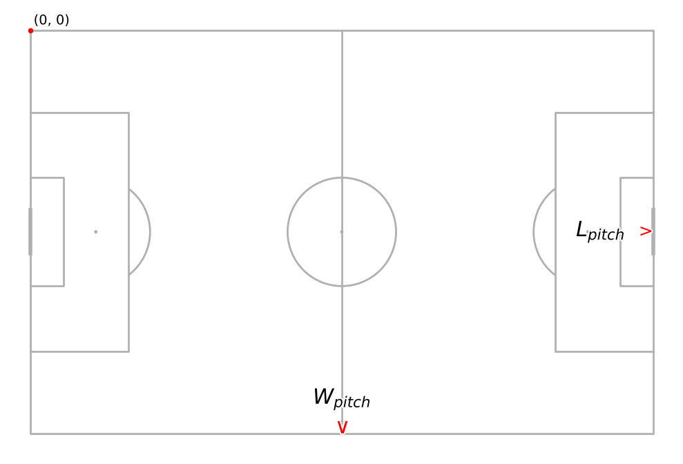
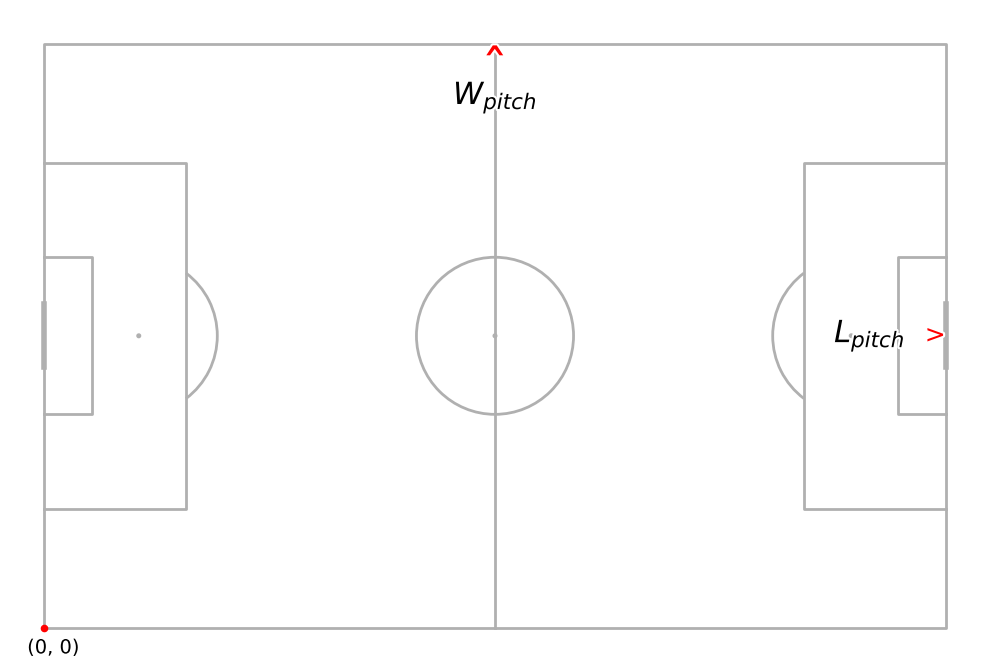
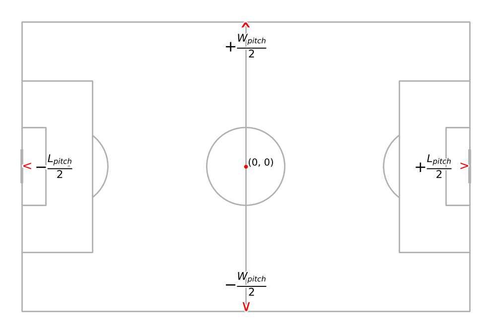
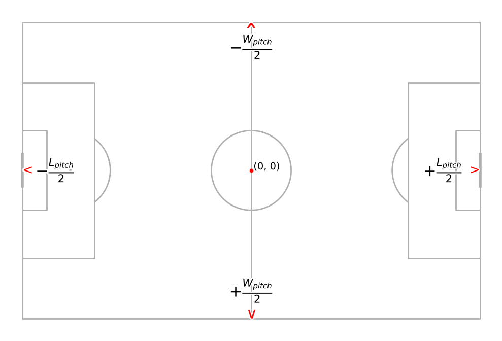

# 📌 Kloppy Coordinate Systems Guide

Kloppy provides support for multiple coordinate systems for event and tracking data, each with different origins and axis directions, and provides built-in conversions to ensure accurate analysis and visualization across various data providers.

## 🌍 Supported Providers
| Provider    | Coordinate System | Origin        | Vertical Orientation |Pitch Length|Pitch Width|
|-------------|-------------------|---------------|----------------------|------------|-----------|
|Kloppy | [KloppyCoordinateSystem](#origin-top-left--vertical-orientation-top-to-bottom) | Top Left| Top to Bottom|1|1
Metrica | [MetricaCoordinateSystem](#origin-top-left--vertical-orientation-top-to-bottom) | Top Left       | Top to Bottom |1|1
HawkEye | [HawkEyeCoordinateSystem](#origin-center--vertical-orientation-bottom-to-top) | Center       | Bottom to Top |?|?|
PFF | [PFFCoordinateSystem](#origin-center--vertical-orientation-bottom-to-top) | Center       | Bottom to Top |105|68
SecondSpectrum | [SecondSpectrumCoordinateSystem](#origin-center--vertical-orientation-bottom-to-top) | Center| Bottom to Top | 105|68
SkillCorner | [SkillCornerCoordinateSystem](#origin-center--vertical-orientation-bottom-to-top) | Center       | Bottom to Top | 105|68
Sportec Event Data | SportecEventDataCoordinateSystem |?|?|?|?
Sportec Tracking Data | [SportecTrackingDataCoordinateSystem](#origin-center--vertical-orientation-bottom-to-top) | Center     | Bottom to Top |?|? 
Opta | [OptaCoordinateSystem](#origin-bottom-left--vertical-orientation-bottom-to-top) | Bottom Left     | Bottom to Top |100|100
Tracab | [TracabCoordinateSystem](#origin-center--vertical-orientation-bottom-to-top) | Center     | Bottom to Top |?|? 
DataFactory | [DatafactoryCoordinateSystem](#origin-center--vertical-orientation-top-to-bottom) | Center     | Top to Bottom |?|?
StatsBomb | [StatsBombCoordinateSystem](#origin-top-left--vertical-orientation-top-to-bottom) | Top Left     | Top to Bottom |120|80 
WyScout | [WyScoutCoordinateSystem](#origin-top-left--vertical-orientation-top-to-bottom) | Top Left     | Top to Bottom |100|100 
SportVU | [SportVUCoordinateSystem](#origin-top-left--vertical-orientation-top-to-bottom) | Top Left     | Top to Bottom |?|? 

Apart from the above data providers, Kloppy also provides support to create your custom coordinate system using `CustomCoordinateSystem`.

## 🔄 Converting Between Systems
Kloppy provides built-in functions to seamlessly convert between coordinate systems.

For example, the following snippet allows you to convert data from StatsBombCoordinateSystem to MetricaCoordinateSystem.
```python
# Load the libraries
from kloppy import statsbomb
from kloppy.domain import MetricaCoordinateSystem

# Load StatsBomb open event data
dataset = statsbomb.load_open_data(
    match_id=15946,
    # Optional arguments
    coordinates="statsbomb",
)

# Transform StatsBomb's coordinate system to SportVUCoordinateSystem
dataset_transformed = dataset.transform(
    to_coordinate_system=MetricaCoordinateSystem()
)
```

## 📖 Glossary  
### Vertical Orientation  
- **Top to Bottom** → The Y-axis increases as you move from the top to the bottom of the pitch.  
- **Bottom to Top** → The Y-axis decreases as you move from the top to the bottom of the pitch.  

### Origin  
- **Top Left** → Origin at the top-left corner of the field.  
- **Bottom Left** → Origin at the bottom-left corner of the field.  
- **Center** → Origin at the center of the field. 

### 📐 Pitch Diagrams
#### Origin: Top Left | Vertical Orientation: Top to Bottom


#### Origin: Bottom Left | Vertical Orientation: Bottom to Top


#### Origin: Center | Vertical Orientation: Bottom to Top


#### Origin: Center | Vertical Orientation: Top to Bottom



