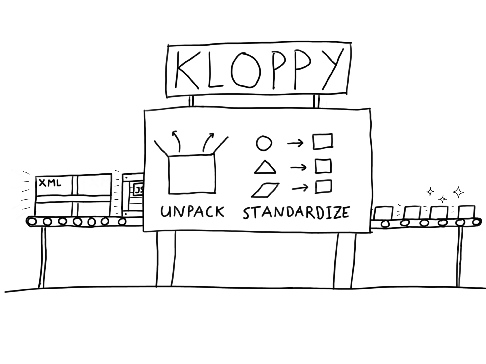

# Getting started

This chapter is here to help you get started quickly with kloppy. It covers the basic features and functionalities of the library. If you're already familiar with kloppy, feel free to skip ahead to the [next chapters](installation.md) for an in-depth discussion of all functionality.

## Installing kloppy

The recommended and easiest way to install kloppy is through `pip`.

```bash
pip install kloppy
```

The [installation guide](installation.md) provides an overview of alternative options.

## Loading data

In soccer analytics, match data typically comes in three main formats: event stream data, tracking data, and Sportscode annotations. Each format has unique advantages and they are often used together to gain a complete view of the story of a match.

Yet, within these main formats, there are notable differences between data providers in terms of the structure, naming conventions, and the depth of information available. This implies that significant patchwork and data plumbing is needed to repeat the same analysis for different data sources.

Kloppy aims to eliminate these inconsistencies between data providers by providing an easy-to-use interface to import data from numerous popular soccer data sources into a common standardized format. In this section, we illustrate how to unpack, manipulate and standardize each type of data. We will illustrate this using samples of publicly available data. For examples on loading data from a specific data provider, see the [Loading Data](/user-guide/providers) section of the user guide.



### Event stream data

Event stream data captures key actions and outcomes during a match, such as passes, shots, tackles, and fouls, usually recorded with timestamps, outcomes and player identifiers. Below, we load the [StatsBomb](https://statsbomb.com) event data of the 2002 World Cup final as an example.

!!! note

    StatsBomb has made event stream data of certain leagues freely available for public non-commercial use at <https://github.com/statsbomb/open-data>. This open data can be accessed without the need of authentication, but its use is subject to a user agreement.

```python exec="true" source="above" session="getting-started"
from kloppy import statsbomb

event_dataset = statsbomb.load_open_data(match_id="3869685")
```

The resulting `event_dataset` is a list of [`Event`][kloppy.domain.Event] entities. Each event is annotated with a set of attributes that describe which players were involved, the outcome of the event, the location where the event took place, etc. As an example, below the event corresponding to the opening goal (a penalty by Lionel Messi) is shown.

```python exec="true" source="tabbed-left" result="text" session="getting-started"
goal_event = event_dataset.get_event_by_id("6d527ebc-a948-4cd8-ac82-daced35bb715")
print(goal_event)
```

Data collection companies like Stats Perform, StatsBomb, and Wyscout have each developed their own event data catalogs, with unique definitions and categorizations for various event types. To address this lack of standardization, kloppy introduces its own [event data model](/reference/event-data). This model facilitates the integration of data from diverse event data catalogs. As an example, the `goal_event` shown above is the kloppy representation of the following raw StatsBomb event.

```python exec="true" result="text" session="getting-started"
print(goal_event.raw_event)
```

The event types in kloppy's data model are a common denominator of the event types and attributes that are supported by most data providers. If a particular event type is not included in kloppy's data model, it will be deserialized as a [`GenericEvent`][kloppy.domain.GenericEvent]. For example, kloppy does not (yet) have a data model for events that describe receiving the ball.

```python exec="true" source="tabbed-left" result="text" session="getting-started"
receival_event = event_dataset.get_event_by_id("0db72b17-bed3-446f-ae22-468480e33ad6")
print(receival_event)
```

Similarly, a particular data provider might provide a particular attribute that is not included in kloppy's data model. For example, StatsBomb annotates each shot event with it's xG value. In some cases, you might want to use this data. In this case, you can easily [extend kloppy's data model](#).


### Tracking data

Tracking data offers high-resolution spatial data that follows the movement of every player and the ball throughout the match. Captured via optical tracking systems or GPS, tracking data allows for detailed analysis of tactics, player positioning, and movement patterns.

```python exec="true" source="above" session="getting-started"
from kloppy import metrica

# Load the raw data, we'll only load the first 30 seconds of the game
fps = 25
tracking_dataset = metrica.load_open_data(
    match_id=3,
    limit=30*fps,
)
```

The actual tracking data is available at `tracking_dataset.frames`. This list holds all frames. Each frame has a `players_coordinates` dictionary that is indexed by [`Player`][kloppy.domain.Player] entities and has values of the [`Point`][kloppy.domain.Point] type.

```python exec="true" source="above" session="getting-started"
home_team, away_team = dataset.metadata.teams
first_frame = tracking_dataset.frames[0]
print(f"Number of players in the frame: {len(first_frame.players_coordinates)}")

from pprint import pprint
print("List home team players coordinates")
pprint([
    player_coordinates
    for player, player_coordinates
    in first_frame.players_coordinates.items()
    if player.team == home_team
])
```

### Sportscode annotations

Lastly, Sportscode data is a format associated with Hudl Sportscode, a popular platform for video analysis in sports. It integrates video clips with detailed tagging of game events, making it ideal for coaches and analysts who need synchronized video and event data to dissect team and player performances.

## Navigating a dataset

Apart from providing a standardized data model for events, kloppy also makes it easy to navigate between events and search for specific events. The example below looks for the assist of the second goal in the game.

```python exec="true" source="tabbed-left" result="text" session="getting-started"
# find all goals
goals = event_dataset.find_all("shot.goal")
# find the last complete pass before the second goal
assist_pass = goals[1].prev("pass.complete")
print(assist_pass)
```


## Coordinate systems

Data providers and analytics software use a variety of coordinate systems to identify locations on the field of play. As exemplified by the prototypical systems shown in Fig. 2, the majority of coordinate systems in use today are oriented horizontally (an aspect revisited in Section 5), and their origin is placed either in the center of the pitch or in the upper or lower left corner. Vertical axis orientation differs with the choice of origin, but the horizontal axis is generally either aligned with a team’s perspective (where the team in possession always plays, say, left to right) or fixed (for instance with respect to the technical area or the main stand). The scaling of axes is another source of variation, with metric, imperial, and relative units of length being the most common.

## Dataframe

Until now, we've worked with kloppy's object-oriented data model. This format is well-suited to preprocess the data. However, to do some actual analysis of the data, it can often be more convenient and efficient to use dataframes.

Kloppy allows you to export a dataset to a dataframe using the [`to_df`][kloppy.domain.Dataset.to_df] method.

```python exec="true" source="above" session="getting-started"
df_events = event_dataset.to_df(engine="pandas")
```

You can use the following engines: `polars`, `pandas`, `pandas[pyarrow]`. The `pandas[pyarrow]` engine requires python 3.8 or higher.

```python exec="true" html="true" session="getting-started"
print(f"""
<div class="md-typeset__scrollwrap"><div class="md-typeset__table">
{df_events.head().to_html(index=False, border="0")}
</div></div>
""")
```

In case not all columns are relevant, you can specify a wildcard pattern. This pattern is matched against all default attributes.


```python exec="true" source="above" session="getting-started"
event_dataset.to_df(
   'period_id',
    'timestamp',
    '*coordinates*',
)
```

Also, it is possible to add additional columns to the dataframe. Kloppy provides some predefined transformers for event stream data, like one to calculate the body part used to perform the action and one to calculate the distance to the goal. When you need additional transformers you can write your own by providing a Callable to `to_df`. Transformers are nothing more than a function which accepts an `Event` and returns a `Dict`. When you use named attributes the returned value can be any type.


```python exec="true" source="above" session="getting-started"
from kloppy.domain.services.transformers.attribute import (
    BodyPartTransformer, DistanceToGoalTransformer
)

event_dataset.to_df(
    "*",  # Get all default columns

    # Predefined transformers
    BodyPartTransformer(),
    DistanceToGoalTransformer()

    # Unnamed transformer must always be defined as a Callable. The function must return a dictionary
    lambda event: {'player_name': event.player, 'team_name': event.player.team},
    
    # Named transformer can be specified as a constant
    some_column=1234,
    
    # Or as a callable
    other_column=lambda x: random.randint(0, 255)
)
```
